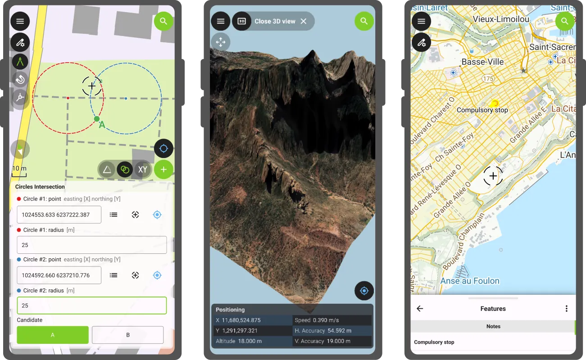
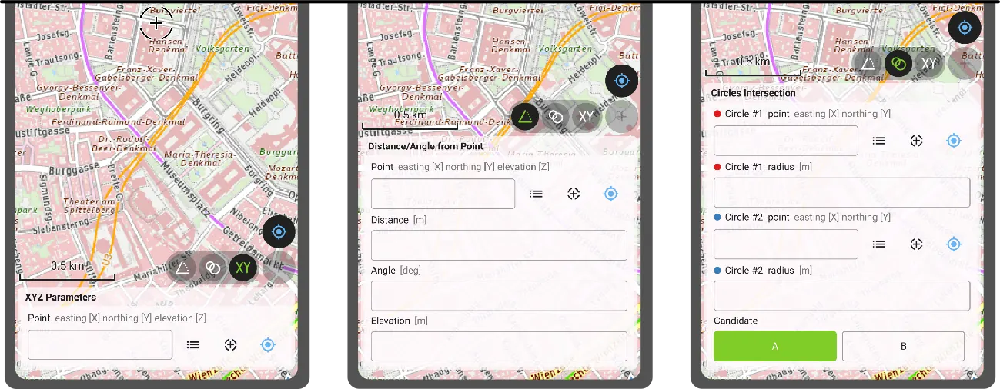

QField’s first release of the year comes packed with new features as well as a bundle of improvements and polishing. Let’s jump right into it.

## Main highlights

### 3D

This new version of QField comes with a **shiny 3D map view**, giving users the ability to render their map content on top of a three-dimensional terrain.

Users can rotate the terrain geometry to get a better understanding of elevation profiles, while also adjusting the plane’s extent by panning and zooming with drag and pinch gestures. When the GNSS positioning service is enabled, the **user’s current position, as well as ongoing tracking sessions, will be overlaid on top of the 3D terrain geometry**.

<video style="max-width:100%;" controls><source src="3d.webm" type="video/webm"></video>

By default, QField relies on Mapzen Global Terrain tiles to determine terrain elevation. As its name indicates, this is a 30-meter digital elevation model covering the globe and hosted online, which allows QField to render 3D views without any user configuration. But it does not stop there. QField **supports additional elevation sources, such as disk-based GeoTIFFs, to work in offline areas**. This can be configured when setting up a project by changing the terrain type in QGIS.

### COGO operations

Moving on to the next major functionality introduced in this new version: a **COGO (Coordinate Geometry) framework to support fieldwork** through a set of parameter-driven operations to generate vertices. This has been one of the most requested features by professional land surveyors, so we couldn’t be more excited to deliver it and hear back from our community.

QField 4.1 ships with three COGO tools:

- The **XYZ parameters** operation generates vertices based on a manually entered pair of X and Y coordinates as well as an optional Z value;
- The **distance/angle from point** operation generates vertices based on distance and angle values from a given point; and
- The **circles’ intersection** operation generates vertices at the intersection of two circles, each defined by a point and a radius.

Leveraging QField's capabilities, a COGO operation’s point parameter can be defined in multiple ways: users can enter values manually or automatically fill in the parameter using either the current GNSS position, the geometry of a pre-existing feature within a point layer, or the coordinate cursor's location. The latter is super useful when coupled with project snapping.

### There's more

Beyond these two flagship features, this new version contains tons of improvements.

We’re happy to report that **the background tracking functionality introduced for Android last year is now available on iOS**. Users can now save battery by locking their phone while QField continues to track positions. Upon reopening QField, the collected positions will be written into your project. No Apple will be left behind.

The feature form continued to receive improvements during this development cycle. Starting with this version, Remember Last Value pins are hidden by default. Moving away from an always-shown interface, **remember last value pin visibility can now be configured per field**. Using the latest QGIS (4.0 and above), users can configure the presence of the pin and whether remembrance should be active by default in the vector layer properties' attribute form panel.

Position tracking has received a lot of attention during this development cycle focused on optimizations. **Tracking is now friendlier to your device battery** while user interface responsiveness has been improved when tracking sessions are ongoing. We've also spent some time making Bluetooth connections to external GNSS devices even more reliable. If this was an issue for you in the past, give this version a try again.

Finally, something to please our advanced users: QField now offers the **ability to tunnel network traffic through a proxy** that can be enabled and configured in the settings panel.

## 'Barents Sea' release name

The Barents Sea, a marginal sea of the Arctic Ocean bordered by Norway and Russia, is one of the most ecologically and geopolitically significant water bodies on the planet. Home to some of the world's largest cod and haddock fisheries, it sustains both marine ecosystems and the livelihoods of coastal communities across the high north. Its waters are a barometer for our changing climate: the Barents Sea is the fastest-warming part of the Arctic, making it a critical area of scientific observation and environmental monitoring. The [Nansen Legacy project](https://arvenetternansen.com/) has been tracking these changes closely ([factsheet](https://arvenetternansen.com/wp-content/uploads/2024/04/The-future-Barents-Sea-fact-sheet-AeN-2024.pdf)).


At OPENGIS.ch, we see the Barents Sea as a powerful symbol of why field data collection matters. Understanding and protecting remote, extreme environments like the Arctic requires tools that are reliable, offline-capable, and built for real-world conditions. That is precisely what QField is designed to deliver.

With QField 4.1 'Barents Sea', we continue building on that mission, bringing new capabilities to field workers, researchers, and environmental stewards wherever their work takes them.

Happy field mapping!
