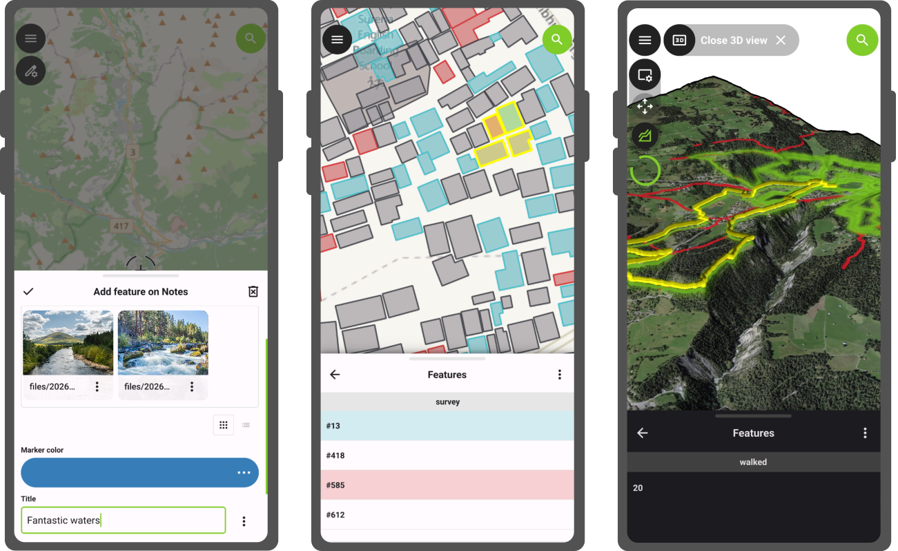
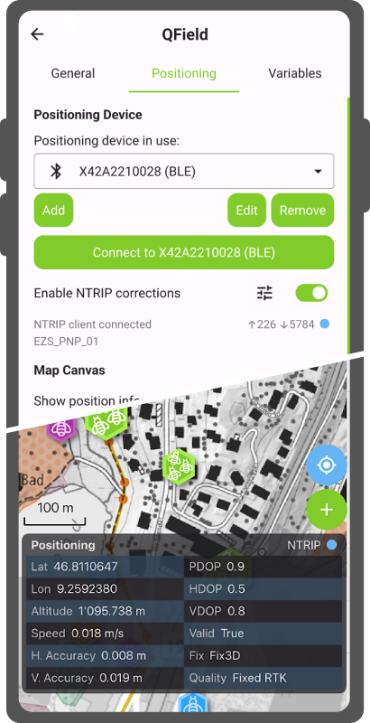
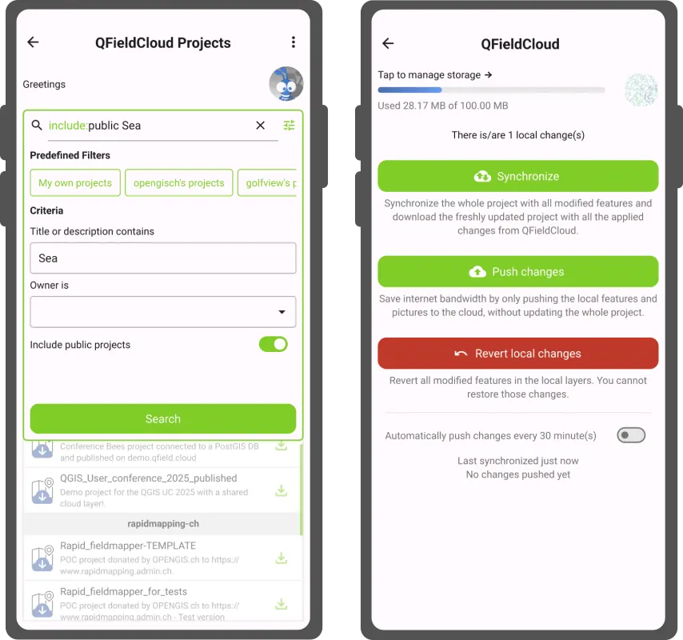

Here comes another packed release of QField delivering functionalities that have long been at the top of professional surveyors’ request lists - hint in the title ;) - while continuing to improve the experience across the board for our broad range of users. Let’s dig into this release right away.

## Main highlights

### NTRIP & Bluetooth Low Energy

First, NTRIP support has been added in QField **unlocking sub-centimeter accuracy position readings without the need for any third-party app**. This had long been requested by cadastral surveyors and other professional field workers in need of highly accurate data where being a few centimeters off can have real consequences.

To configure an NTRIP connection, simply connect to an RTK correction-capable GNSS device via Bluetooth, BLE or TCP from the QField settings positioning panel. Once connected, the NTRIP user interface will be visible just below the positioning devices combo box in the same panel. 

From there, users can enter their NTRIP caster details and enable the connection. An NTRIP visual indicator has also been added at the top of the map canvas positioning information panel overlay to reflect the status of the connection. A blue dot means all is good, a glowing orange dot means the connection has stopped receiving correction data, and a gray dot means the connection has turned off.

Moving onto another functionality that walks hand in hand with NTRIP: QField now **supports connecting to external GNSS devices via Bluetooth Low Energy (BLE)**. This means a whole array of GNSS devices can now talk directly to QField also on iOS, simplifying workflows for field surveyors working on this platform. While the benefit is most visible on iOS as QField previously lacked the ability to talk through Bluetooth altogether on that platform, BLE connections are also available on Android, Windows, and Linux. In many cases, it can offer a stabler connection to the device.

The **development of these fantastic features were supported by two QField hardware partners: HappySurvey and ArduSimple**. Their support meant we were able to focus on getting the best possible experience running on their device. Other hardware will definitively work out of the box too, and we’re looking forward to hearing from the community about this. However, since we are dealing with functionalities that are often driven by vendor-specific commands and UUIDs, there’s plenty of room to grow when it comes to compatibility. Vendors out there, take a moment to reach out, [join our certified hardware program](https://qfield.org/hardware/) and support QField’s growth! :)

Moving on to another noteworthy newly-added functionalities.

### Feature form improvements

Starting with QField 4.2, the feature form has gained a **novel gallery editor which provides previews of image, video, and audio content** from relationships where the child layer has one or more attachment attributes. The “power up” will turn itself on automatically when QField detects such a scenario. The gallery editor also offers a quick snap button allowing for a much faster workflow around photos and video capture. And yes, we’ve updated our notes layer to support this when creating projects using QField.

Also improving the feature form is a **wizard mode that can greatly simplify a complex set of tabs into a linear experience** driven by an easy to use pair of next and previous buttons that are reacting to constraints. The wizard mode is a per-project setting that can be enabled when setting up projects in QGIS. Simply make sure QFieldSync is installed to see the configuration panel in the project properties dialog.

<video style="max-width:100%;" controls><source src="wizard.webm" type="video/webm"></video>

### Feature identification in 3D, and more

Users enjoying QField’s recent addition of 3D views will be delighted by what’s coming next. **Feature identification by tapping on the terrain in 3D map views** is now possible. This adds a crucial functionality that removes the need to switch back and forth between 2D and 3D to do attribute editing or getting more information on a nearby point of interest during your 3D map view enhanced hike in your favorite national park.

There are countless more improvements that would transform this announcement into a full on essay ;) to highlight a few more:

- A new **project information popup** accessible via the side dashboard **displays crucial project metadata such as the title, the abstract description, and the author(s)**. 

- The **features list now reflect attribute table's row conditional styling** configured in QGIS, providing a nice way to add visual hints to make features in need of attention pop out in the list;

- **Audio attachments have gained a level preview visual** that helps identify key parts of a clip during playback.

- Lines and polygons digitized using a stylus in freehand mode are now smoother with cleaner geometries to avoid overly dense vertices; and

As always, the full changelog is available over here for even more goodies.

## A flood of QFieldCloud improvements

This new version of QField is packed with QFieldCloud improvements. The biggest one is the retirement of the cloud projects ‘community’ tab in favor of a **completely revamped – and we believe improved – experience around cloud project searches and filtering**. Users can now easily filter projects by organization and teammate ownership as well as by keywords. The new user interface also makes searching through the countless cloud projects that have been made public by authors around the world far more intuitive.

A brand new **cloud storage indicator has been added to QField** to let users know of their current used and remaining storage size. This will help users keep on top of their storage and provide an early warning when space is about to run out. Upgrade plans are available for users to keep working on these growing cloud projects.

Beyond that, we’ve been hard at work hunting bugs and increasing the overall stability. We’ve also transformed a number of obscure and intimidating error messages into helpful notifications that will leave users with clearer understandings.

## 'Coral Sea' release name

The Coral Sea stretches across the southwest Pacific, bordered by Australia, Papua New Guinea, Solomon Islands, and Vanuatu. Home to the Great Barrier Reef and some of the most biodiverse coastal ecosystems on the planet, it is also one of the most climate-pressured, with bleaching events and coastal change outpacing many monitoring programs.

Field workers across the region are already responding with QField: mapping seagrass and mangroves for blue carbon conservation with the [MACBLUE project](https://www.macblue-pacific.info/), building national environmental monitoring capacity through [SPREP's regional GIS training](https://www.sprep.org/news/regional-training-on-geographic-information-system-gis-tools-and-environmental-data-management-held-in-apia), running standardized tropical field data collection at the [Leibniz Centre for Tropical Marine Research](https://www.leibniz-zmt.de/de/), and driving land cover surveys across 10 Pacific Island nations through [Digital Earth Pacific](https://digitalearthpacific.org/) and the [maplandscape project](https://livelihoods-and-landscapes.com/about.html).

At OPENGIS.ch, the Coral Sea is a reminder that the places most in need of reliable field data are often the hardest to reach. That is precisely what QField is built for.

Happy field mapping!
