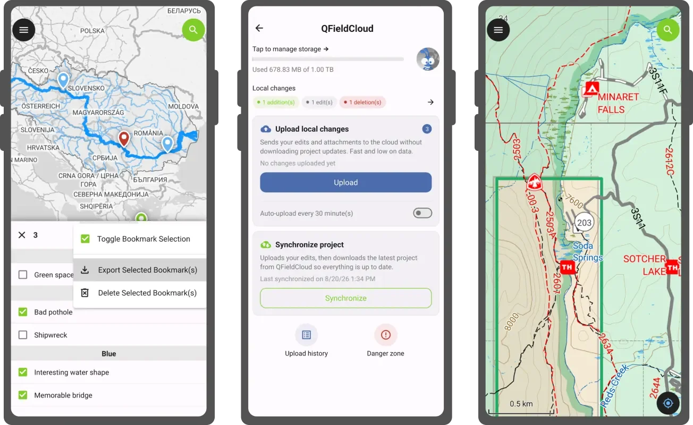
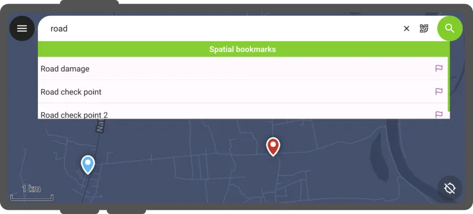
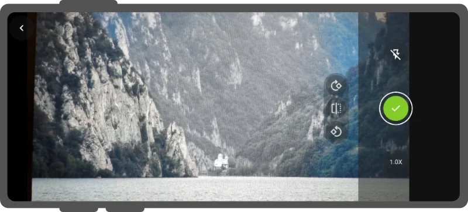
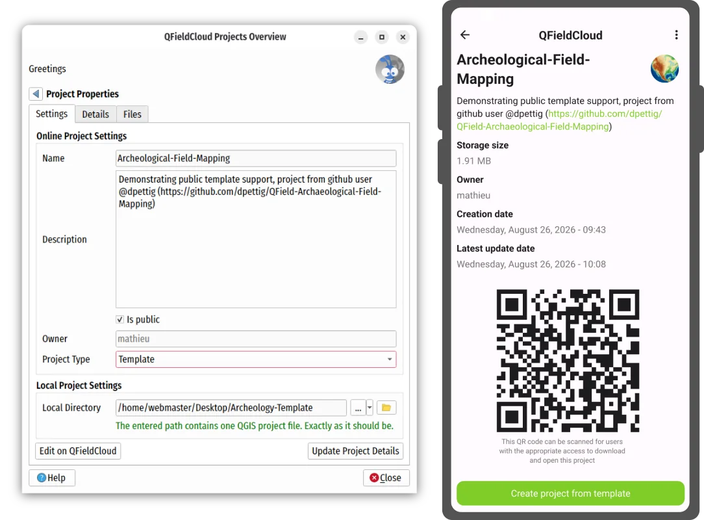
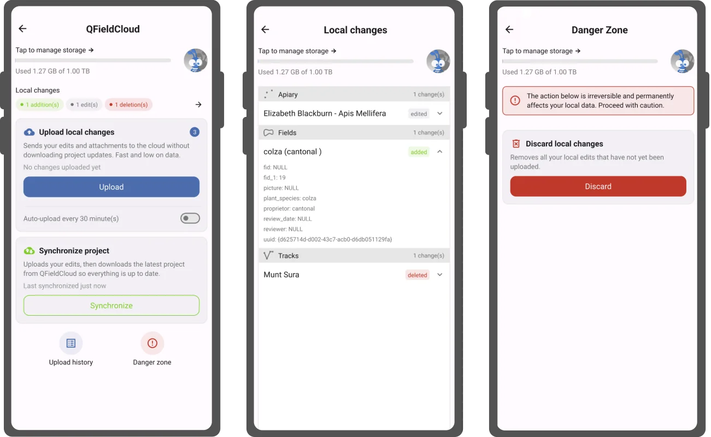
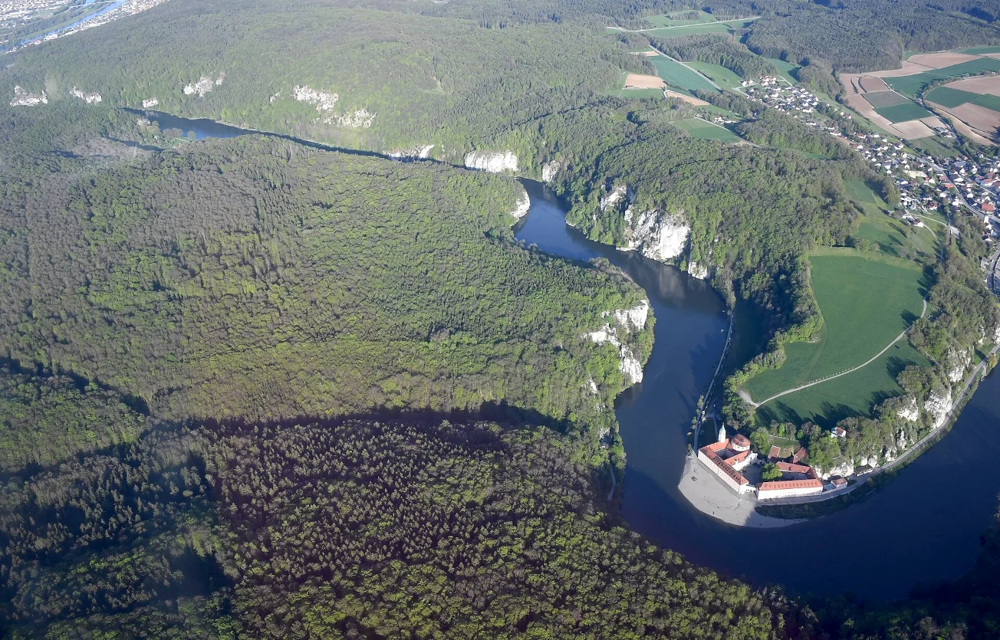

The next version of QField is here. While this time of the year is a well-deserved holiday period for many, we’ve dedicated ourselves to improving the stability and refining of your favorite field mapping tool. 

We’re calling this effort the “summer of stability”, a sprint we will undertake on a yearly basis. But there are plenty of improvements to cover, so let’s go over them.

## Main highlights

### Bookmark manager

First, we’ve introduced **a new bookmark manager to make QField’s experience around spatial bookmarking feel more complete**. With the manager accessible via the dashboard’s main menu – users will be able to browse their bookmarks as a full list with the ability to quickly jump to a bookmark’s location by tapping its name, as well as edit its properties. 

Furthermore, users will also be able to **export bookmarks as a geopackage**, which means the data captured through spatial bookmarks is no longer locked within users’ devices anymore. And, if users’ bookmarks become irrelevant, the manager also allows for **bulk deletion of bookmarks**.

While improving the relevance and usefulness of bookmarks, we added a **“navigate to bookmark” action to the search bar results**.

### Rock-solid camera

As mentioned above, this release focused on refinement and polish, and the camera got special attention. We’ve added **logic to ensure that the rotation of snapped photos matches expectations**. When the device angle gets too tricky for that to work, **users can now manually rotate and flip photos** while previewing them. We also improved camera stability by preventing auto-focus and auto-white balance from freezing the process when the hardware or the operating system fails us.

Image stamping has been improved too: it’s now possible to **write details on your images coming from the layer and features** the images will be attached to. This is sure to please many of our users as it was requested more than once across our [community discourse](https://community.qfield.org/) and [ideas platform](https://ideas.qfield.org/).

### QFieldCloud-delivered project templates

Leveraging [QFieldCloud](https://qfield.cloud/)'s latest capabilities, this new version of QField introduces a **new way to create projects while in the field: project templates**.

When setting up projects in QFieldCloud, users can now flag them as templates. This newly-introduced type allows users to create new projects from these templates through QField itself in the field.

Templates become super handy when shared within an organization where all affiliated members can have access to the template. And of course, when the templates are made public, they turn into a fantastic shared resource for the broader community. Trust us, it beats a GitHub repository archive any day of the week ;)

### Polished cloud project management

One of the most important ways to manage QFieldCloud data in QField is through its cloud project panel, accessed by tapping the blue cloud button at the top of the dashboard.

In this new version, **the cloud project panel has gone through an evolutionary step**. Changes include:

- We’ve made the language easier to understand by non-technical people. Words like “push” and “revert” are replaced with “upload” and “discard”.

- We also re-ordered the interactive elements to ensure that the most important action was most visible: uploading changes.

- QField will proactively remind users of pending local changes when they are about to end a mapping session.

- To avoid accidental data loss, we’ve relocated the discarding or local changes action to a new ‘danger zone’ sub-panel.

In addition, the cloud project control panel now offers a summary and detailed view of local changes. This allows for users to review the feature addition, editing, and deletion prior to uploading and synchronizing them back to QFieldCloud.

Haven’t tried QFieldCloud yet? [Sign up for a free community account](https://app.qfield.cloud/accounts/signup/)!

### Wait, there’s more

One of the main objectives of this development cycle has been to improve upon preexisting functionality. 

Let’s go over a few notable improvements.

The **QR code scanner can now capture codes from images picked through the device’s gallery**. As more and more QR codes are shared digitally, You’ll never be stuck having to send a friend the QR code you need to scan on your smartphone ever again ;)

On the feature form side,the **value relation editor widget now does accent-less searches** allowing for faster data entry. The **relation editor widgets respect the configured sorting order** defined during project set up. And finally, the gallery editor’s chosen mode – thumbnail vs. list - will be remembered.

## Still wondering what the summer of stability means for you?

As mentioned in the introduction, this release is the culmination of a new yearly sprint we call “summer of stability”. Let’s expand a bit on this.

One of the metrics used to judge whether our efforts were successful is the number of sessions that crashed reported on our anonymized metrics platform. By the end of the sprint, the platform showed a **dramatic decrease in crashes (>20% reduction in reported crashes)**. That is a bottom line that tells us we are making QField more stable!

Beyond that, we’ve also increased our number of automated test cases that act as safeguard against silent regressions every time we commit a change in QField. An extra 27% lines of code were added covering C++ classes and QML items that were until now not tested. This is the way we ensured that the impact of this stability sprint will not dissipate overnight.

## “Danube” release name

The Danube is the longest river in the European Union. Rising in Germany's Black Forest, it flows through ten countries and four capital cities — Vienna, Bratislava, Budapest, and Belgrade — before emptying into the Black Sea, sustaining ecosystems, agriculture, energy infrastructure, and the livelihoods of millions along its banks.

_Photo by [Carsten Steger](https://commons.wikimedia.org/wiki/File:Aerial_image_of_the_Danube_Gorge_near_Weltenburg.jpg)_

This summer, the Danube made headlines for the wrong reasons. Record-low water levels, driven by unprecedented heatwaves, have exposed long-sunken WWII warships and forced drastic action to protect critical infrastructure. In Hungary, the Paks nuclear power plant, which generates nearly half of the country's electricity using Danube water for cooling, was forced to take all but one of its reactors offline. The European Commission's Joint Research Centre confirmed the Danube had reached record-low levels, with reduced flows putting pressure on navigation, water supplies, agriculture, and the energy sector. The river that has connected civilisations for millennia is telling us something urgent.

At OPENGIS.ch, we believe that rivers like the Danube are not just geography: they are living systems that require careful observation and data-driven management. Better field data, collected faster and more reliably, is part of how we respond to a changing world.

That is what QField is built for.
