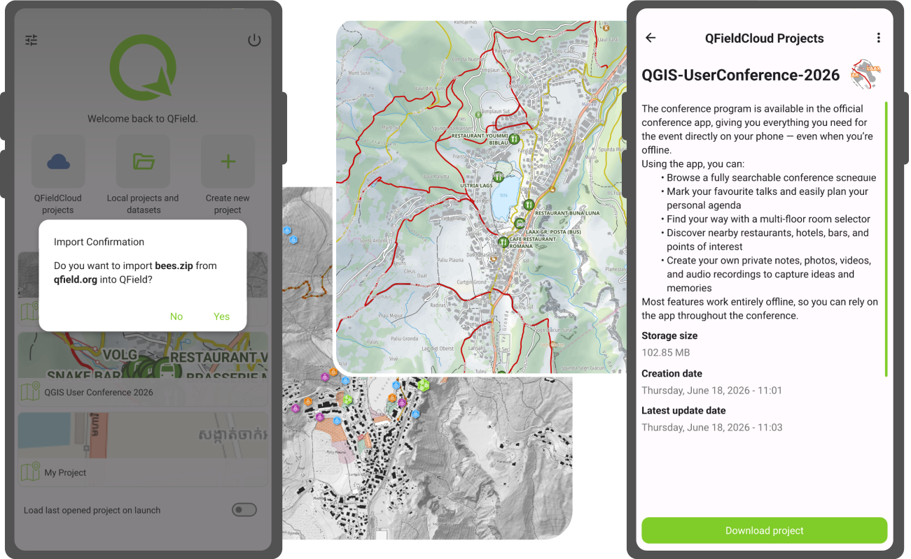
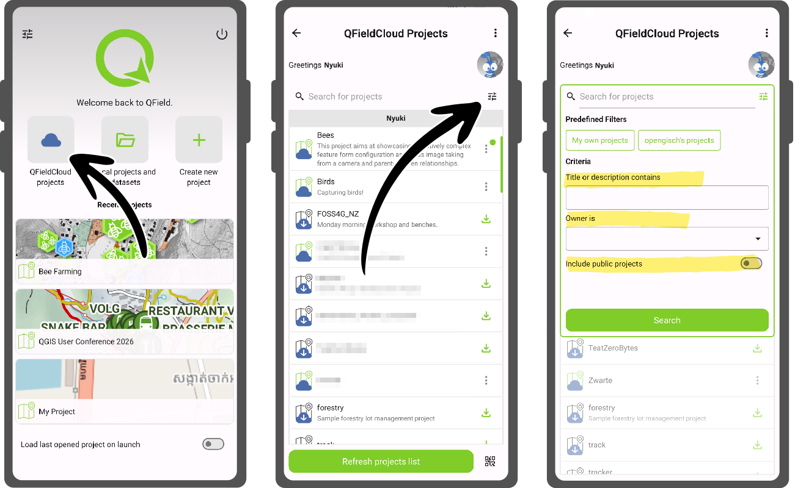
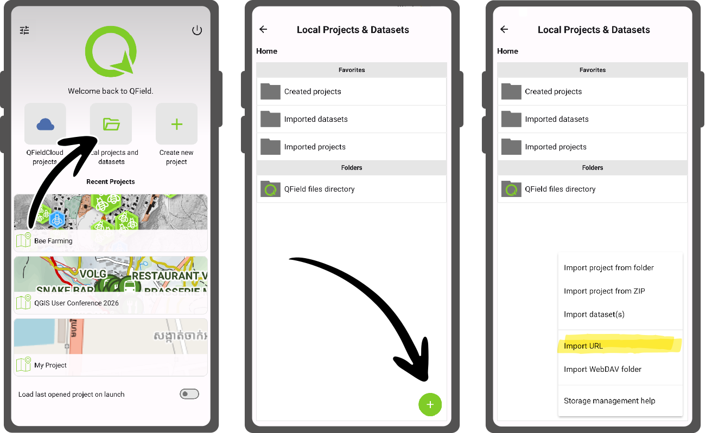
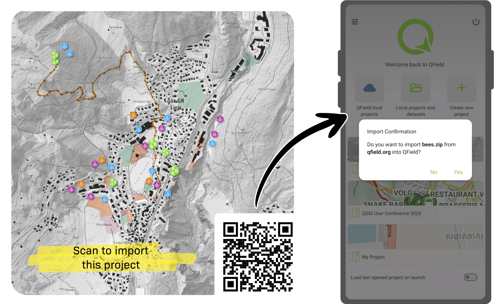

Over the years, QField has gained a number of ways through which authors can share their mapping projects. This post looks at the multiple ways this can be achieved and what scenarios fit each method best.

## Leveraging QFieldCloud

### Sharing maps to the public

QFieldCloud users all have the ability to configure their projects as ‘public’. When the option is turned on, all QFieldCloud users will be allowed to download and browse these maps at will.

These users coming in to view the map are given a reader role, prohibiting changes to the underlying datasets included in the project. This can be a great option when wanting to share maps to a large number of readers while relying on QFieldCloud to host the content and keep users up-to-date through synchronization.

Upload your mapping projects onto [QFieldCloud](https://qfield.cloud/) and make them public through the web interface or QFieldSync. The public can then hop onto QField, log into QFieldCloud, and get to the maps by searching for the user and project names.

QFieldCloud’s registry is free and you get 100MB of free storage, [give it a try](https://app.qfield.cloud/accounts/signup/)!

*Note that since QField 4.2, improvements made to the experience around cloud projects filtering have made finding these public projects much simpler.*

### Sharing collaborative maps with organization teammates and co-workers

If the maps are meant to be private and/or editable in a collaborative way, sharing them as part of a [QFieldCloud organization plan](https://qfield.cloud/pricing) is the way to go. Members of a registered organization are able to create projects in which the content of maps can be edited collaboratively and synchronized on-the-fly straight from the field.

These projects will automatically appear in the cloud projects list of logged in users that are organization members and project collaborators, making it effortless to reach and download.

## Importing through web URLs

It is also possible to share maps without relying on QFieldCloud. While we strongly believe QFieldCloud offers the best user experience, QField is all about providing its users with the freedom to choose.

Sharing maps can be done by compressing a QGIS project into a ZIP archive or simply sharing a georeferenced PDF and offering that file through a web site URL. Users wanting to import these files into QField then open the local projects and datasets panel from the welcome screen, click on the bottom right plus sign ‘import’ button, and select the ‘Import from URL’ menu action.

*Importing from a URL works across all platforms QField runs on: Android, iOS, Windows, and Linux.*

## Sharing through QR codes

All of what’s described above can be made even easier by leveraging QR codes.

### QFieldCloud QR codes

For maps shared on QFieldCloud, users can generate QR codes using their favorite online tool or application by using the following URI format:

`qfield://cloud?project={username}/{project_name}`

Simply replace the `{username}` and `{project_name}` with the username or organization owning the project as well as the project name. The resulting QR code can be scanned from devices using the operating system camera and will automatically open QField to an informative cloud project details view.

### Web URL QR codes

For maps shared through a web site URL, similar QR codes can be generated by using the following URI format:

`qfield://local?import={url}`

Simply replace the `{url}` with a web URL that points to a compressed QGIS project ZIP or georeferenced PDF file (e.g. http://qfield.org/sample-projects/bees.zip). When scanning these QR codes, QField will open a dialog asking users whether to proceed forward with the importing of a file name (e.g. map.pdf) from the URL’s domain name.

